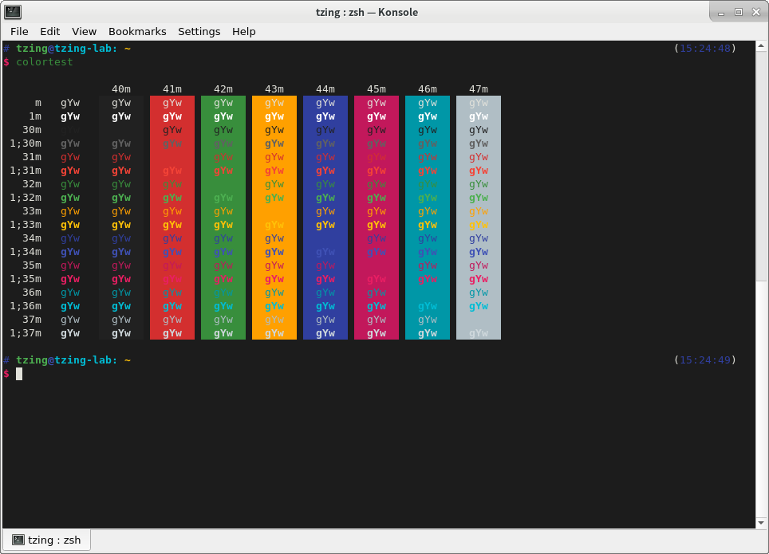

# Material Konsole

Color scheme for [Konsole].



Inspired by [papercolor] the theme for vim.

[Konsole]: https://konsole.kde.org/
[papercolor]: https://github.com/NLKNguyen/papercolor-theme

## Usage

```sh
cd ~/.local/share/konsole/
curl -O "https://raw.githubusercontent.com/tzing/material-konsole/master/Material Dark.colorscheme"
```
